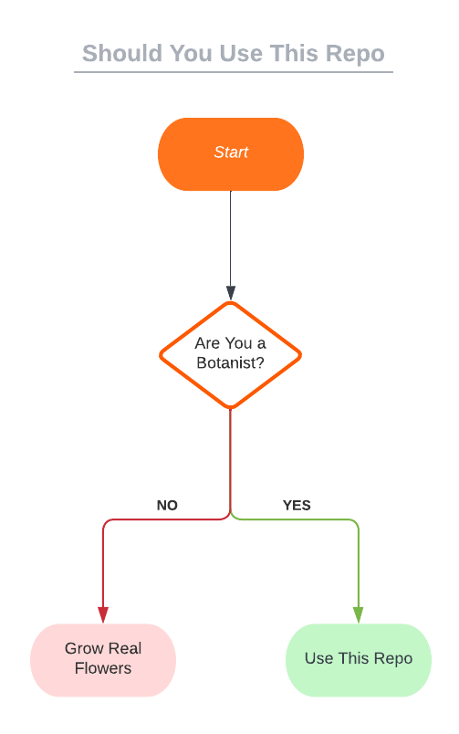

# Grow Some Flowers

🌼🌸❀✿🌷

https://user-images.githubusercontent.com/12191303/187256924-9e697ea7-e66f-492d-8dca-c03f136d9157.mp4


## Have you ever wanted to grow flowers but don't know where to start?

Do you need a graduation present, valentines day gift, or flowers for some other event?
Do you want to grow the flowers yourself, but don't know where to start the process?

*This flow chart will help you get started.*



## Usage

Growing flowers has never been easier.  You can do it with two steps:

```bash
python train.py
```

Then:

```bash
./shell/create-training-video.sh artifacts/same-noise same-noise
```

In 2022, that's all it takes to grow flowers.
